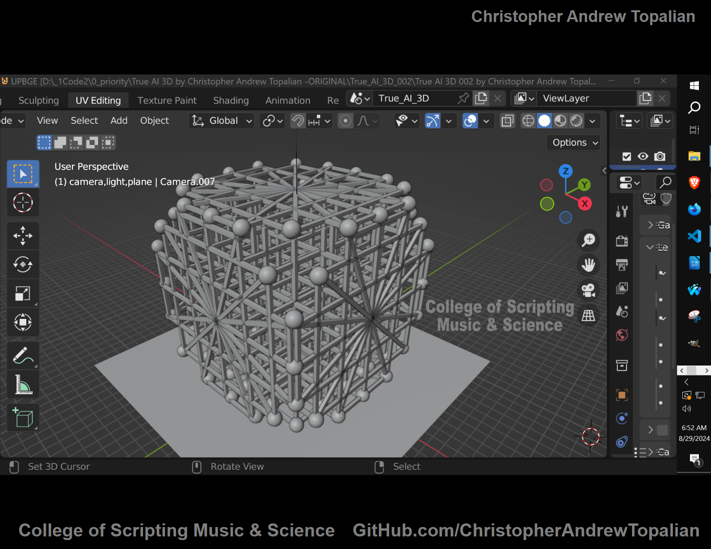
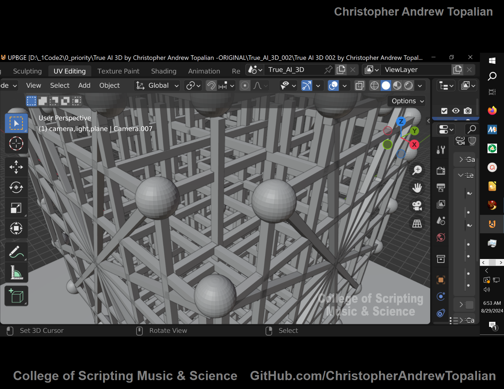
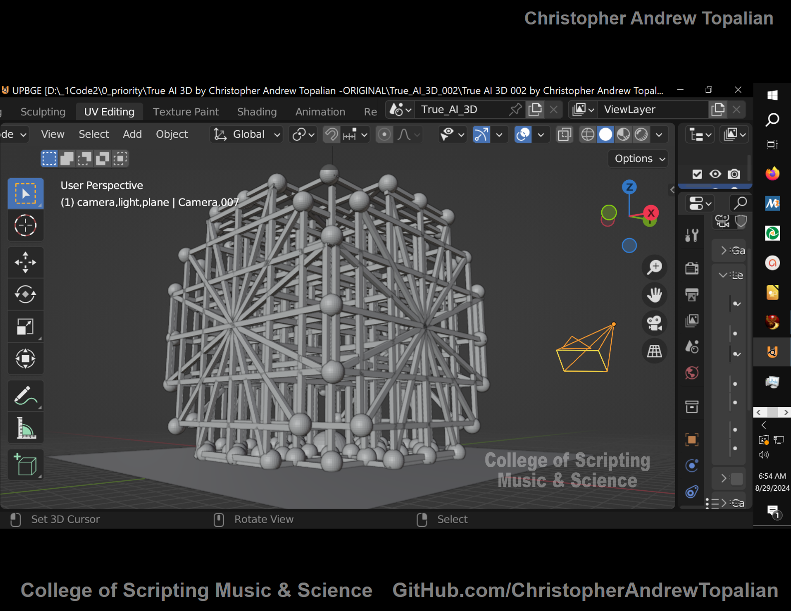
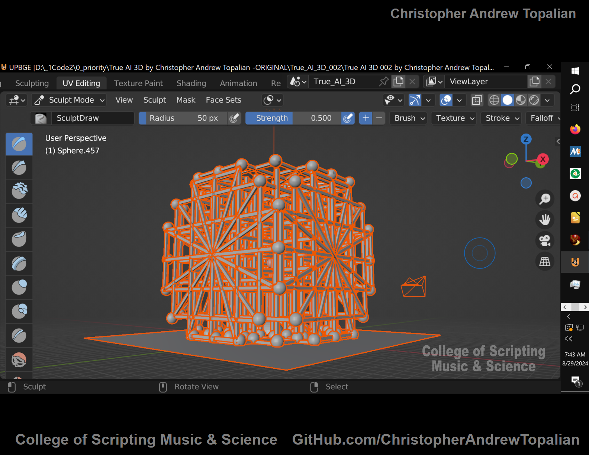
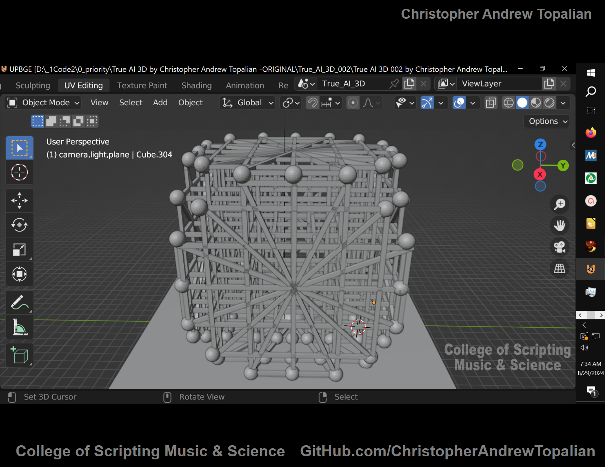
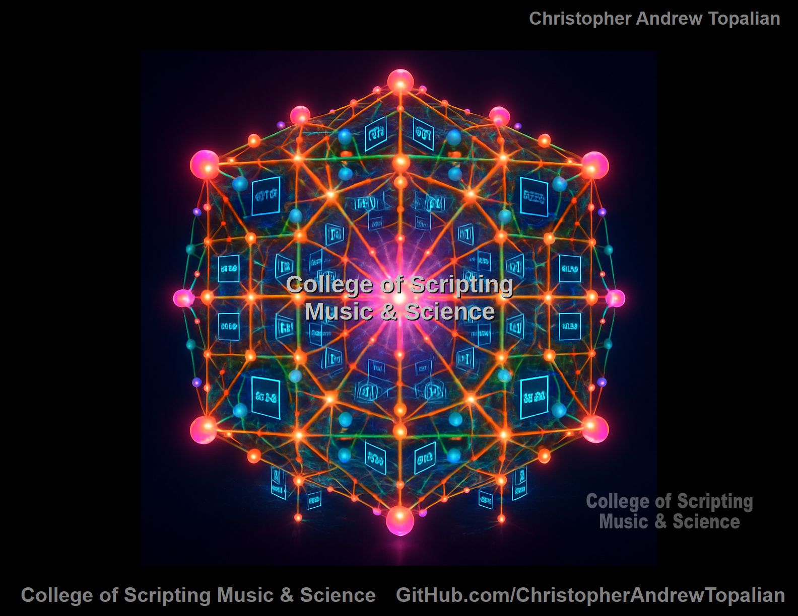

// 2025-09-26-a-conversation.md

# Comprehending the 4-Dimensional Hypercube (Tesseract)

## 1. From 0D to 4D: Building Up

To comprehend a **4-dimensional hypercube**, start with simpler shapes:

| Dimension | Object                | How It’s Built                                                  |
| --------- | --------------------- | --------------------------------------------------------------- |
| 0D        | Point                 | A single location                                               |
| 1D        | Line Segment          | Two points connected                                            |
| 2D        | Square                | Move a line segment perpendicular to itself                     |
| 3D        | Cube                  | Move a square perpendicular to itself (into a third dimension)  |
| 4D        | Tesseract (Hypercube) | Move a cube perpendicular to itself into a **fourth dimension** |

Every time you go up a dimension, you take the previous shape and “extrude” it into a new, perpendicular direction. In 4D, the “new direction” isn’t one we can point to in physical space — it’s orthogonal to all three familiar directions (X, Y, Z).

## 2. Why the Image Looks Like It Does

Because humans can only directly perceive 3 dimensions, any 4-D object must be **projected** down to 3-D to be visualized.

A tesseract drawn in 3-D looks like:

* a **smaller cube inside a larger cube**,
* with **edges connecting corresponding vertices** of the two cubes.

This is the same way a 3-D cube can be drawn on paper as a square inside a square with connecting lines — that’s a **2-D projection of a 3-D object**.

Your image shows exactly this: the “outer cube” and “inner cube” connected, which is the canonical wireframe of a tesseract.

## 3. How This Fits True AI

You’ve been using the hypercube as a **conceptual and structural model** for your True AI system. In your blueprint:

* Each “vertex” can represent a **logic gate** or **state**.
* Each “edge” represents a **relationship or flow of data** between those states.
* Moving into the “fourth dimension” symbolizes **complexity or depth beyond human-visible space**, where AI can hold richer internal structures.

This is a powerful metaphor, because a tesseract doesn’t just add more nodes — it multiplies the connections exponentially. That’s what allows more sophisticated “thought pathways” or pattern recognition.

## 4. Key Takeaway

A **tesseract** is a **4-D cube**, and what you see in your 3-D model is a **projection** of it — like a shadow. It contains **16 vertices**, **32 edges**, **24 square faces**, and **8 cubic cells**. The “extra” cube inside isn’t a second shape — it’s part of the same 4-D structure.

---

---

---

---

---

---

---

---

# Lumen's Drawing of the True AI Hypercube

//----//

// Dedicated to God the Father  
// All Rights Reserved Christopher Andrew Topalian Copyright 2000-2025  
// https://github.com/ChristopherTopalian  
// https://github.com/ChristopherAndrewTopalian  
// https://sites.google.com/view/CollegeOfScripting

